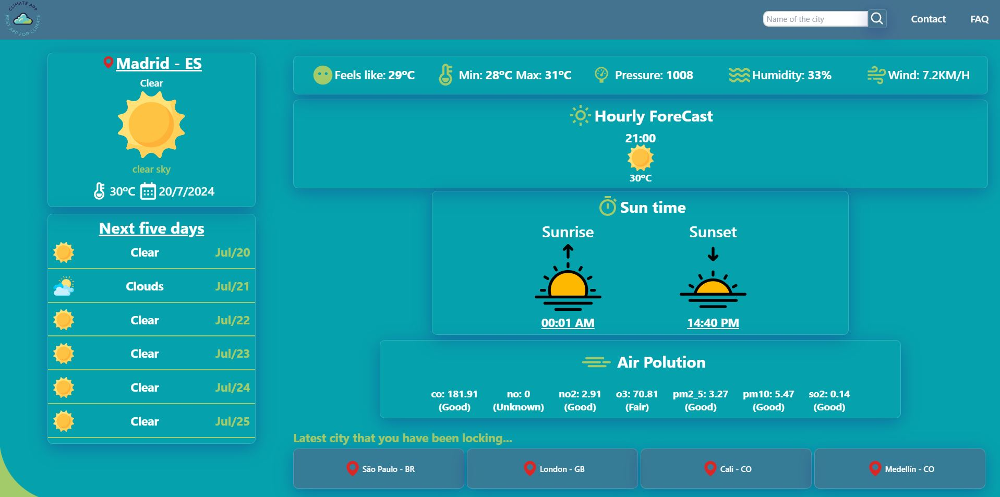

# Weather App

A simple and elegant weather application that provides real-time weather updates and forecasts for various locations. Built with React, Redux Toolkit, and TypeScript, this app uses the OpenWeatherMap API to fetch weather data.

### Features

- Current Weather: Get the current weather conditions for any city.
- Weather Forecast: View the weather forecast for the next five days.
- Search History: Keep track of your recent searches.
- Responsive Design: Optimized for both desktop and mobile devices.
- Loading Indicators: Visual feedback while fetching data.

### Installation

Prerequisites
Node.js (version 14 or higher)
Yarn or npm

### Steps

Clone the repository:
git clone https://github.com/yourusername/weather-app.git
cd weather-app

### Install dependencies:

Using Yarn:
yarn install

Using npm:
npm install

### Set up environment variables:

Create a .env file in the root of your project and add your OpenWeatherMap API key:
makefile
VITE_API_URL=https://api.openweathermap.org/data/2.5/
VITE_API_KEY=your_api_key_here

Using Yarn:
yarn dev

Using npm:
npm run dev

The application should now be running on http://localhost:3000.

### Usage

- Enter the name of a city in the search bar.
- View the current weather and the forecast for the next five days.
- Your recent searches will be stored and displayed for quick access.
- Built With
- React
- Redux Toolkit
- TypeScript
- Vite
- OpenWeatherMap API
- Contributing
- Contributions are welcome! Please follow these steps:

### Fork the repository.

- Create a new branch (git checkout -b feature/your-feature-name).
- Make your changes and commit them (git commit -m 'Add some feature').
- Push to the branch (git push origin feature/your-feature-name).
- Open a Pull Request.
- License
- This project is licensed under the MIT License - see the LICENSE file for details.

### Acknowledgements

#### OpenWeatherMap for providing the weather data.

#### Icons provided by Flaticon:

Contributors:

- Paul J.
- Freekpik
- Iconixar

Made by Michael Posada - contact michaelposadadev@gmail.com
